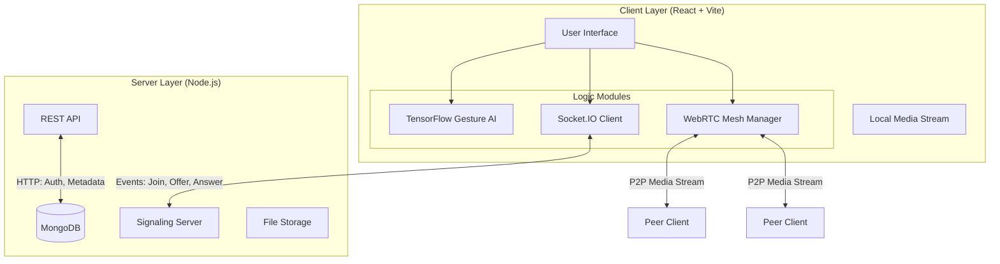

# ⚡ Collaborative Meeting Platform - Engineering Report

> **Project Status**: Active Development 🟢  
> **Version**: 1.0.0

## 1. 📖 Abstract & Introduction

This project is a state-of-the-art **Real-Time Collaboration & Video Conferencing System** designed to bridge the gap between communication and co-creation. Unlike traditional platforms (Zoom, Google Meet) that segregate communication tools, this platform integrates **AI-powered interaction**, **collaborative document editing**, and **interactive whiteboarding** directly into the video interface.

The system utilizes a **Mesh Peer-to-Peer Architecture** for low-latency video streaming and a centralized **Event-Driven Signaling Server** to manage complex meeting states. It features a modern, glassmorphic UI designed for an immersive user experience.

---

## 2. 🏗️ System Architecture

### 2.1 High-Level Architecture
The system follows a hybrid Client-Server model. Video/Audio streams are transmitted directly between peers (Mesh WebRTC), while application state (Chat, Whiteboard, Auth) is synchronized via a central server.



### 2.2 Signaling Sequence Diagram
The following diagram illustrates the complex flow required to establish a connection between two users joining a meeting.

```mermaid
sequenceDiagram
    participant UserA as User A (Joiner)
    participant Server as Signaling Server
    participant UserB as User B (Host/Peer)

    UserA->>Server: emit(join-room, {meetingId, userId})
    Server->>UserB: emit(user-connected, {userId})
    
    rect rgb(20, 20, 20)
    note right of UserB: WebRTC Handshake Initiated
    UserB->>UserB: createOffer()
    UserB->>Server: emit(offer, {offer, target: UserA})
    Server->>UserA: emit(offer, {offer, sender: UserB})
    
    UserA->>UserA: createAnswer()
    UserA->>Server: emit(answer, {answer, target: UserB})
    Server->>UserB: emit(answer, {answer, sender: UserA})
    
    loop ICE Candidates
        UserB->>Server: emit(ice-candidate)
        Server->>UserA: emit(ice-candidate)
    end
    end
    
    UserA<-->>UserB: P2P Audio/Video Stream Established 🟢
```

---

## 3. 🛠️ Technology Stack

| Layer | Technology | Purpose |
| :--- | :--- | :--- |
| **Frontend** | **React 19** | Component-based UI Architecture. |
| | **TypeScript** | Type safety and robust code structure. |
| | **TailwindCSS v4** | Utility-first styling with Glassmorphism support. |
| | **Vite** | Next-generation frontend tooling and bundler. |
| **Real-Time** | **WebRTC** | Native browser API for peer-to-peer media streaming. |
| | **Socket.IO** | Bi-directional event-based communication. |
| **AI / ML** | **TensorFlow.js** | Browser-side machine learning runtime. |
| | **Fingerpose** | Hand landmark detection and gesture classification. |
| **Backend** | **Node.js + Express** | Scalable server runtime and REST API framework. |
| **Database** | **MongoDB** | NoSQL database for flexible content storage. |

---

## 4. 💾 Database Schema Design

The application uses MongoDB to store persistent data. Below are the core schemas.

### 4.1 User Schema (`users`)
Stores authentication and profile details.
| Field | Type | Required | Description |
| :--- | :--- | :--- | :--- |
| `name` | String | Yes | Full name of the user. |
| `email` | String | Yes | Unique email address (Index). |
| `password` | String | Yes | Bcrypt hashed password. |
| `role` | Enum | No | `host` or `participant` (Default: `participant`). |
| `resetPasswordToken` | String | No | Hashed token for password recovery. |

### 4.2 Meeting Schema (`meetings`)
Manages meeting sessions and history.
| Field | Type | Description |
| :--- | :--- | :--- |
| `meetingId` | String | Unique readable ID for the room. |
| `host` | ObjectId | Reference to the `User` who created it. |
| `title` | String | Custom title for the meeting. |
| `isActive` | Boolean | Status of the meeting session. |
| `participants` | Array | Log of users who joined and their join times. |

### 4.3 Document Schema (`documents`)
Stores the state of the collaborative document for persistence.
| Field | Type | Description |
| :--- | :--- | :--- |
| `meetingId` | String | Links document to a specific meeting. |
| `content` | Object | The raw Delta object from Quill editor (JSON). |
| `versions` | Array | History of changes for version control. |

---

## 5. 🔌 API & Event Reference

### 5.1 REST API Endpoints

#### Authentication (`/api/auth`)
*   `POST /register` - Create a new user account.
*   `POST /login` - Authenticate and receive JWT.
*   `POST /forgotpassword` - Initiate password reset email flow.
*   `PUT /resetpassword/:token` - Set new password.

#### Meeting Management (`/api/meetings`)
*   `POST /` **[Protected]** - Create a new meeting room.
*   `GET /:id` **[Protected]** - Fetch meeting metadata and validate ID.

#### Utilities (`/api/upload`)
*   `POST /` - Upload image/file attachment (Multipart Form Data).

### 5.2 Real-Time Socket Events

| Category | Event Name | Direction | Payload Description |
| :--- | :--- | :--- | :--- |
| **Signaling** | `join-room` | Client -> Server | `{ meetingId, userId, name }` |
| | `user-connected` | Server -> Client | Notifies peers of a new user. |
| | `offer` / `answer` | Bidirectional | WebRTC Session Description Protocol (SDP). |
| **Whiteboard** | `draw-line` | Bidirectional | `{ x0, y0, x1, y1, color, width }` |
| | `clear-canvas` | Client -> Server | Requests a board wipe. |
| **Editor** | `send-changes` | bidirectional | Quill Delta object (text changes). |
| | `cursor-change` | bidirectional | `{ index, length, name, color }` |
| **AI** | `gesture-detected` | Client -> Local | Internal event triggering UI actions. |

---

## 6. 🦾 Feature Implementation Details

### A. AI Gesture Controller
The system runs a **ResNet-based** hand detection model in a background worker. It samples the webcam feed at 100ms intervals (throttled for performance).
1.  **Detection**: `handpose` model identifies 21 key landmarks on the hand.
2.  **Estimation**: `fingerpose` calculates the slope between key points (e.g., finger tips vs. knuckles).
3.  **Action**:
    *   **Open Palm** → Triggers "Raise Hand" event.
    *   **Victory (V)** → Toggles "Mute/Unmute".
    *   **Thumbs Up** → Sends Emoji Reaction.

### B. Collaborative Whiteboard
Implements an **Optimistic UI** update pattern.
*   When a user draws, the line is rendered immediately on their local canvas (`<canvas>` API).
*   The coordinate data is normalized (0.0 to 1.0) to handle different screen sizes and emitted via Socket.IO.
*   Receiving clients map the normalized coordinates to their local viewport size and render the line.

---

## 7. 🚀 Installation & Setup

1.  **Clone the Repository**
    ```bash
    git clone https://github.com/StartHawk/Void.git
    ```

2.  **Environment Configuration**
    Create a `.env` file in the `server` directory:
    ```env
    PORT=5000
    MONGO_URI=mongodb+srv://...
    JWT_SECRET=your_secret_key
    ```

3.  **Install Dependencies**
    ```bash
    # Install Root Dependencies
    npm install

    # Install Client & Server Dependencies (Recursive)
    npm run install-all
    ```

4.  **Start Development Servers**
    ```bash
    npm start
    # Runs Server on :5000 and Client on :5173
    ```
