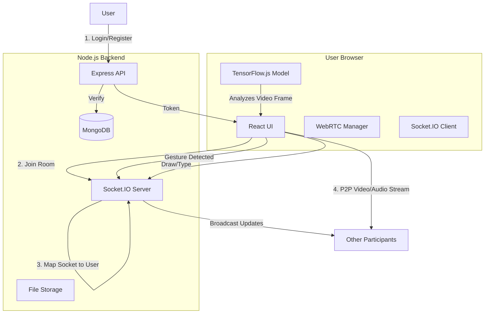

# ⚡ Collaborative Meeting Platform - Project Documentation

## 1. 🚀 Project Overview

This project is a cutting-edge real-time collaboration and video conferencing platform designed to go beyond simple video calls. It integrates advanced features like **AI-powered gesture control**, **collaborative code/text editing**, **interactive whiteboards**, and **smart meeting management** into a single, cohesive interface. 

The application is built with a "Privacy First" mesh architecture for video (WebRTC) and a robust centralized signaling server for real-time state management.

## 2. 🆚 Comparison: Why is this different?

| Feature | 🦖 Traditional (Zoom/Meet) | ⚡ This Platform |
| :--- | :--- | :--- |
| **Interaction** | Buttons & Hotkeys | **AI Hand Gestures** (👍 = Emoji, ✋ = Raise Hand) |
| **Collaboration** | Screen Share only | **In-Meeting Real-time Editor** (Quill) & **Whiteboard** |
| **Visuals** | Basic/Corporate | **Premium Glassmorphism** & Dynamic Animations |
| **Architecture** | SFU/MCU (Server Heavy) | **Mesh WebRTC** (Peer-to-Peer, Lower Latency) |
| **Customization** | Limited | **Fully Customizable** Open Source Logic |

## 3. 🛠️ Tech Stack & Unique Libraries

### Frontend (Client)
A high-performance Single Page Application (SPA).

*   **Core**: React 19, TypeScript, Vite (Build Tool).
*   **Styling**: **Hybrid Approach**. Uses `TailwindCSS` v4 for utility classes combined with extensive **Custom CSS Variables** and **Glassmorphism** effects (see `index.css`).
*   **Real-time Communication**:
    *   `socket.io-client`: For chat, whiteboard state, and signaling.
    *   **WebRTC**: Native browser API for peer-to-peer audio/video streaming.
*   **AI & Machine Learning (Unique Feature)**:
    *   `@tensorflow/tfjs` & `@tensorflow-models/handpose`: Runs neural networks directly in the browser to detect hands.
    *   `fingerpose`: Analyzes hand landmarks to recognize specific gestures (Thumbs Up, Victory, Open Palm).
*   **Collaboration Tools**:
    *   `quill` & `quill-cursors`: Rich text editor with real-time multi-user cursor tracking.
    *   `framer-motion`: For fluid UI animations (floating elements, page transitions).
    *   `emoji-picker-react`: Integrated emoji support.
    *   `lucide-react`: Modern icon set.

### Backend (Server)
A robust Node.js environment handling signaling and persistence.

*   **Runtime**: Node.js & Express.js.
*   **Real-time Engine**: `socket.io`: Handles thousands of events for chat updates, drawing coordinates, and WebRTC signaling (Offers/Answers/ICE Candidates).
*   **Database**: **MongoDB** (with Mongoose) for storing:
    *   User Profiles.
    *   Meeting Metadata.
    *   Chat History (likely).
*   **Security**:
    *   `bcryptjs`: Password hashing.
    *   `jsonwebtoken` (JWT): Stateless authentication.
    *   `helmet`: HTTP header security.
    *   `cors`: Cross-Origin Resource Sharing management.
*   **Utilities**:
    *   `multer`: Handling file uploads locally (`/uploads` directory).
    *   `nodemailer`: Sending system emails (e.g., Forgot Password).

## 4. 🔮 Key Features Breakdown

### A. 🤖 AI Gesture Controller
*   **How it works**: Uses the user's webcam feed (separate from the meeting stream) to run a background tensor flow model.
*   **Triggers**:
    *   **Thumbs Up**: Sends a "👍" reaction to the room.
    *   **Open Palm**: Toggles "Raise Hand" status.
    *   **Victory/Peace**: Toggles Video On/Off.
    *   **OK Sign**: Custom reaction.

### B. 📝 Collaborative Workspace
*   **Whiteboard**: A shared canvas where all users can draw simultaneously. Changes are broadcast via Socket.IO events (`draw-line`, `clear-canvas`).
*   **Editor**: A shared document editor. Users can type together, seeing each other's color-coded cursors in real-time.

### C. 📹 Smart Video Meeting
*   **Mesh Network**: Users connect directly to every other user. If 4 people are in a call, each person maintains 3 separate peer connections.
*   **Features**:
    *   Screen Sharing.
    *   Dynamic Grid Layout.
    *   Audio Level Detection (Visualizers).

### D. 👑 Admin Controls
*   The meeting creator (Admin) has special privileges:
    *   **Kick User**: Remove someone from the meeting.
    *   **Mute Everyone**: Force mute participants.
    *   **Stop Video**: Disable a user's camera.

## 5. 📐 Architecture & Workflow



## 6. 📂 Project Structure Guide

*   **`client/src/pages/MeetingRoom.tsx`**: The heart of the application. Manages the complex state of streams, peers, and socket events.
*   **`client/src/components/GestureController.tsx`**: Encapsulated logic for loading TF models and processing video frames.
*   **`server/index.js`**: Main entry point. Contains the massive Socket.IO event handler for all real-time logic.
*   **`server/models`**: Database schemas (`User.js`, `Meeting.js`).
*   **`client/src/index.css`**: The definition of the "Glassmorphism" design system.

## 7. 🚀 Installation & Setup

1.  **Prerequisites**: Node.js, MongoDB.
2.  **Server Setup**:
    ```bash
    cd server
    npm install
    # Create .env file with PORT, MONGO_URI, JWT_SECRET
    npm start
    ```
3.  **Client Setup**:
    ```bash
    cd client
    npm install
    npm run dev
    ```
